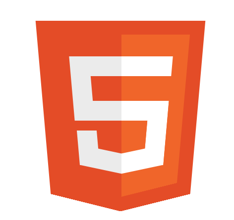
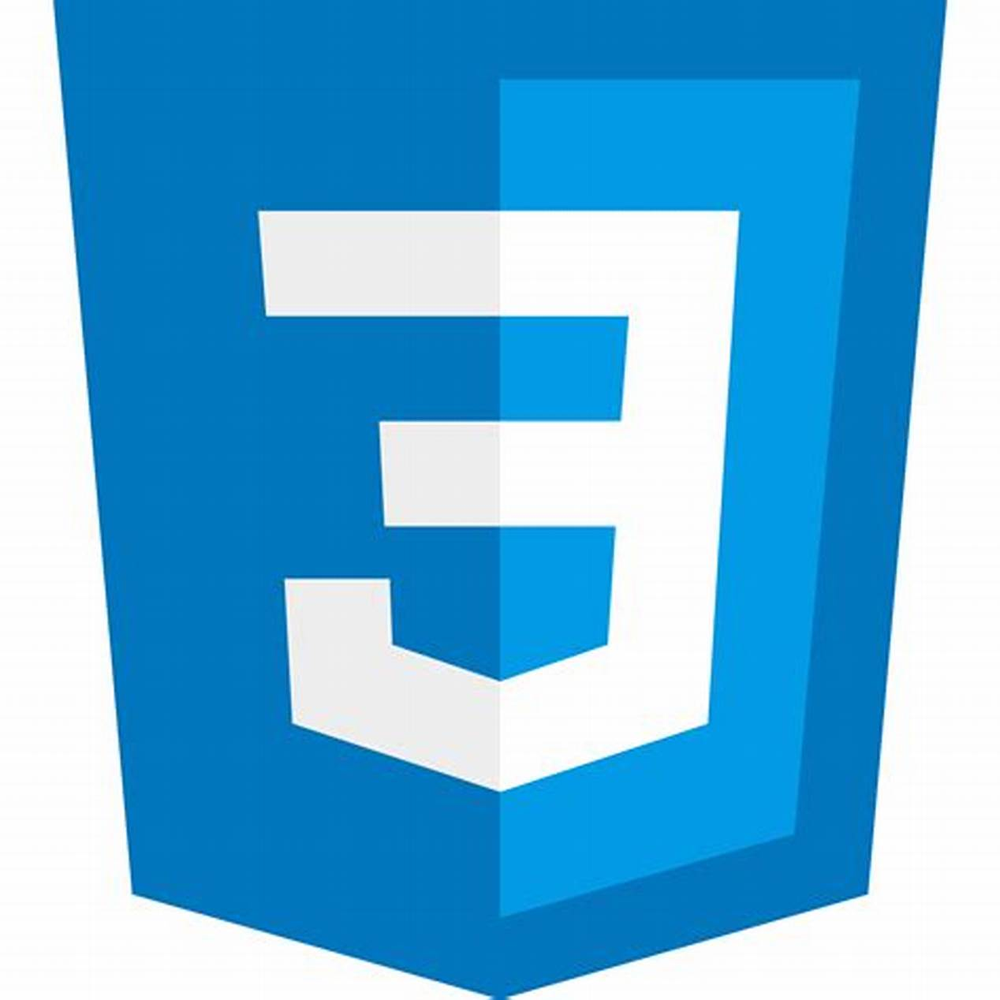
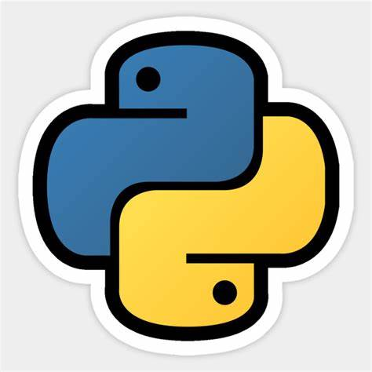

<h2>Portfolio:</h2>
<h3 align="center"> 👋 Hello, I’m @Hadi-AlKammouni </h3>
- 👀 I’m interested in coding (◔◡◔).
 
- 🌱 I’m currently learning FSW (full stack web development) at SE factory.
 
- 💞️ I’m looking to collaborate with other developers.
 
- 📫 I'll be glad if you reach me via hadialkammouni99@gmail.com .

<!---
Hadi-AlKammouni/Hadi-AlKammouni is a ✨ special ✨ repository because its `README.md` (this file) appears on your GitHub profile.
You can click the Preview link to take a look at your changes.
--->

<h2>Languages:</h2>

 
<h2>Statistics:</h2>
