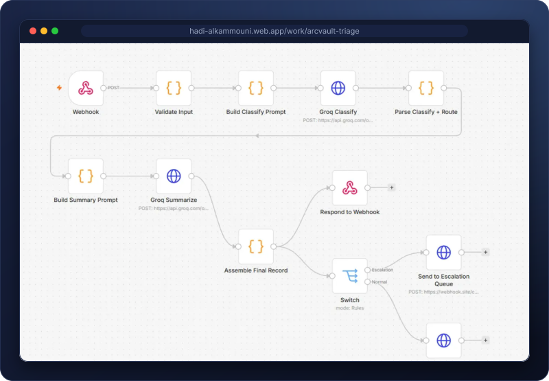
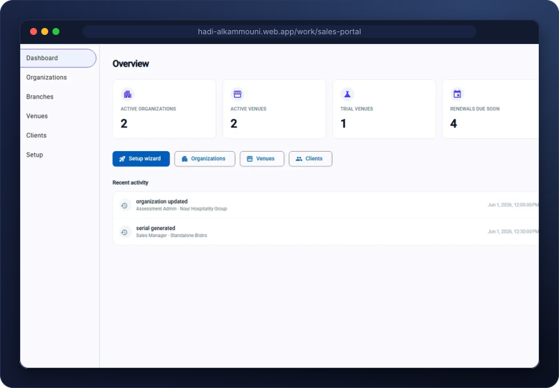
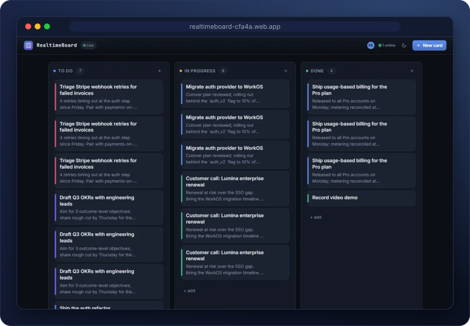
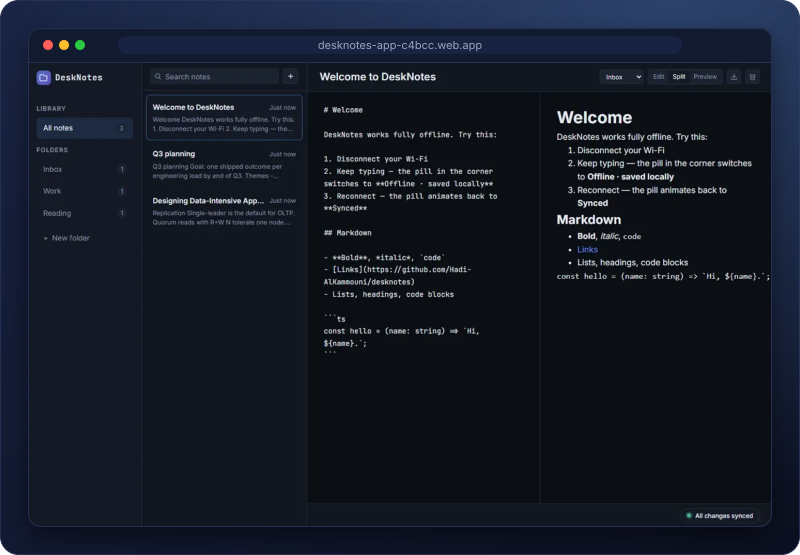
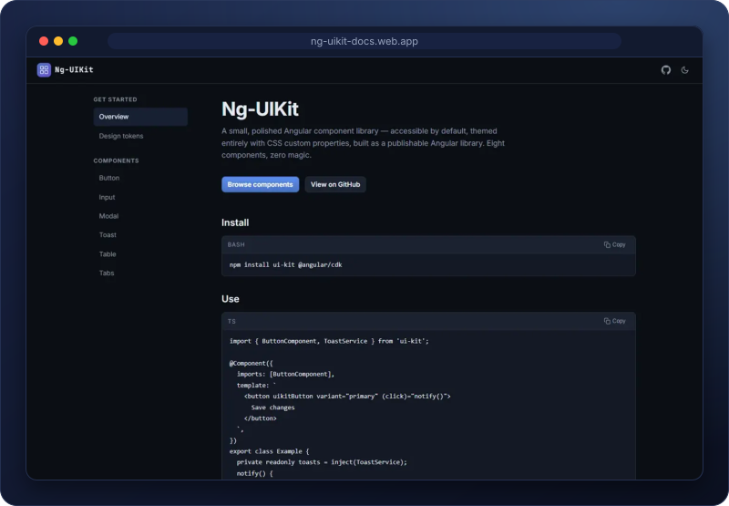
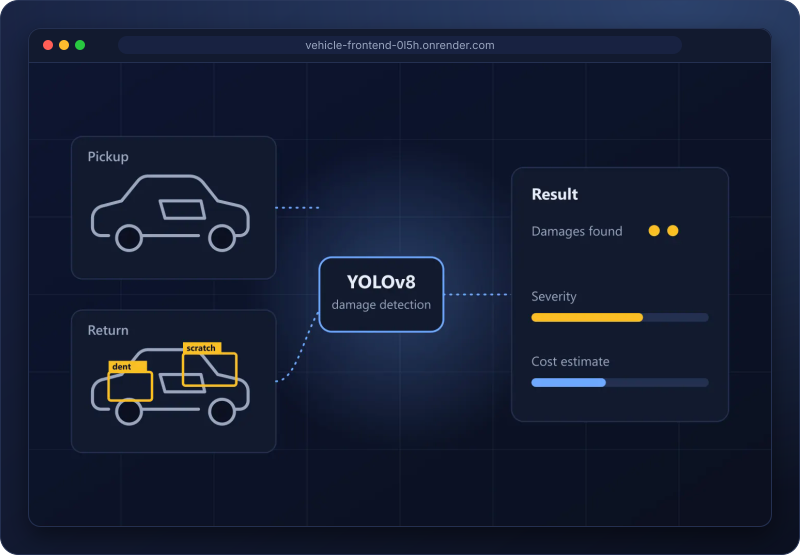

<!-- Generated by scripts/build.mjs from profile.json. Edit those and run `npm run build`, not this file. -->

<a href="https://hadi-alkammouni.web.app">
<picture>
  <source media="(max-width: 700px)" srcset="assets/banner-compact-dark.svg">
  <source media="(prefers-color-scheme: light)" srcset="assets/banner-light.svg">
  
</picture>
</a>

 

  <a href="https://hadi-alkammouni.web.app"><picture><source media="(prefers-color-scheme: light)" srcset="assets/buttons/portfolio-light.svg"></picture></a>&nbsp;
  <a href="https://www.linkedin.com/in/hadialkammouni/"><picture><source media="(prefers-color-scheme: light)" srcset="assets/buttons/linkedin-light.svg"></picture></a>&nbsp;
  <a href="mailto:hadialkammouni99@gmail.com"><picture><source media="(prefers-color-scheme: light)" srcset="assets/buttons/email-light.svg"></picture></a>

##  About

Full stack developer in Beirut, front-end heavy. I spent 3+ years building a multi-country enterprise platform at ITXI (Angular, NgRx, Firebase, Electron), and now I also ship LLM pipelines where the model reads and plain code decides. Open to full-time and freelance work.

<table>
<tr>
<td width="33%" valign="top">
 
<b>Full stack apps</b> 
Angular, React, and Node.js. Clean, tested, shipped.
</td>
<td width="33%" valign="top">
 
<b>Real-time and offline</b> 
Live sync, offline-first apps, Electron desktop.
</td>
<td width="33%" valign="top">
 
<b>AI workflows</b> 
LLMs read; plain code decides.
</td>
</tr>
</table>

<b>3+ years</b> enterprise front-end &nbsp;&nbsp;•&nbsp;&nbsp; <b>Multi-country</b> production deployments &nbsp;&nbsp;•&nbsp;&nbsp; <b>&lt; 1s</b> real-time sync &nbsp;&nbsp;•&nbsp;&nbsp; <b>~1.2s</b> LLM triage latency

##  Featured work

<table>
<tr>
<td width="50%" valign="top">
<a href="https://hadi-alkammouni.web.app/work/arcvault-triage/"><picture><source media="(prefers-color-scheme: light)" srcset="assets/projects/arcvault-light.svg"></picture></a>
<h3>ArcVault AI Triage</h3>
LLM pipeline that routes requests and escalates only what needs a human.
  
<b>~1.2s</b> median latency 
<code>n8n</code> <code>Groq LLM</code> <code>Docker</code>
  
<a href="https://www.loom.com/share/8ba74ee489aa4cd89e17c99e573a1ef6"><picture><source media="(prefers-color-scheme: light)" srcset="assets/buttons/video-primary-light.svg"></picture></a>&nbsp;
<a href="https://github.com/Hadi-AlKammouni/arcvault-triage"><picture><source media="(prefers-color-scheme: light)" srcset="assets/buttons/repo-light.svg"></picture></a>
</td>
<td width="50%" valign="top">
<a href="https://hadi-alkammouni.web.app/work/sales-portal/"><picture><source media="(prefers-color-scheme: light)" srcset="assets/projects/sales-portal-light.svg"></picture></a>
<h3>Sales Portal</h3>
Client onboarding portal with a guided wizard that recovers from failure.
  
<b>2 paths</b> guided onboarding 
<code>Angular</code> <code>Tailwind</code> <code>Playwright</code>
  
<a href="https://hadi-alkammouni.web.app/work/sales-portal/"><picture><source media="(prefers-color-scheme: light)" srcset="assets/buttons/case-primary-light.svg"></picture></a>&nbsp;
<a href="https://github.com/Hadi-AlKammouni/sales-portal"><picture><source media="(prefers-color-scheme: light)" srcset="assets/buttons/repo-light.svg"></picture></a>
</td>
</tr>
<tr>
<td width="50%" valign="top">
<a href="https://realtimeboard-cfa4a.web.app"><picture><source media="(prefers-color-scheme: light)" srcset="assets/projects/realtimeboard-light.svg"></picture></a>
<h3>RealtimeBoard</h3>
Live kanban: every change syncs to all users in under a second.
  
<b>&lt; 1s</b> sync across users 
<code>Angular</code> <code>Firebase</code> <code>Playwright</code>
  
<a href="https://realtimeboard-cfa4a.web.app"><picture><source media="(prefers-color-scheme: light)" srcset="assets/buttons/live-primary-light.svg"></picture></a>&nbsp;
<a href="https://github.com/Hadi-AlKammouni/realtimeboard"><picture><source media="(prefers-color-scheme: light)" srcset="assets/buttons/repo-light.svg"></picture></a>
</td>
<td width="50%" valign="top">
<a href="https://desknotes-app-c4bcc.web.app"><picture><source media="(prefers-color-scheme: light)" srcset="assets/projects/desknotes-light.svg"></picture></a>
<h3>DeskNotes</h3>
Offline-first markdown notes for web and Windows, syncing when back online.
  
<b>Offline-first</b> web + Windows 
<code>Angular</code> <code>Electron</code> <code>Firestore</code>
  
<a href="https://desknotes-app-c4bcc.web.app"><picture><source media="(prefers-color-scheme: light)" srcset="assets/buttons/live-primary-light.svg"></picture></a>&nbsp;
<a href="https://github.com/Hadi-AlKammouni/desknotes"><picture><source media="(prefers-color-scheme: light)" srcset="assets/buttons/repo-light.svg"></picture></a>
</td>
</tr>
<tr>
<td width="50%" valign="top">
<a href="https://ng-uikit-docs.web.app"><picture><source media="(prefers-color-scheme: light)" srcset="assets/projects/ng-uikit-light.svg"></picture></a>
<h3>Ng-UIKit</h3>
Accessible Angular component library with a live docs site.
  
<b>6</b> accessible components 
<code>Angular</code> <code>TypeScript</code> <code>Playwright</code>
  
<a href="https://ng-uikit-docs.web.app"><picture><source media="(prefers-color-scheme: light)" srcset="assets/buttons/live-primary-light.svg"></picture></a>&nbsp;
<a href="https://github.com/Hadi-AlKammouni/ng-uikit"><picture><source media="(prefers-color-scheme: light)" srcset="assets/buttons/repo-light.svg"></picture></a>
</td>
<td width="50%" valign="top">
<a href="https://vehicle-frontend-0l5h.onrender.com/"><picture><source media="(prefers-color-scheme: light)" srcset="assets/projects/vehicle-ai-light.svg"></picture></a>
<h3>Vehicle Damage AI</h3>
Compares pickup and return photos and detects damage with YOLOv8.
  
<b>YOLOv8</b> computer vision 
<code>NestJS</code> <code>FastAPI</code> <code>YOLOv8</code>
  
<a href="https://vehicle-frontend-0l5h.onrender.com/"><picture><source media="(prefers-color-scheme: light)" srcset="assets/buttons/live-primary-light.svg"></picture></a>
</td>
</tr>
</table>

>  **Visitors Management Platform**: Multi-country visitor and permit operations: real-time sync, biometric access, offline desktop. 3+ years, enterprise, under NDA. [Read the case study ↗︎](https://hadi-alkammouni.web.app/work/visitors-management-platform/)

<a href="https://hadi-alkammouni.web.app/#work">All work on the portfolio ↗︎</a>

##  Tech stack

<picture>
  <source media="(max-width: 700px)" srcset="assets/stack-compact-dark.svg">
  <source media="(prefers-color-scheme: light)" srcset="assets/stack-light.svg">
  
</picture>

 

  <picture><source media="(prefers-color-scheme: light)" srcset="https://raw.githubusercontent.com/Hadi-AlKammouni/Hadi-AlKammouni/output/languages-light.svg"></picture>

##  Experience

**ITXI** &nbsp;·&nbsp; Beirut, Lebanon &nbsp;·&nbsp; 3 yrs 6 mos

| Role | Period |
| :-- | :-- |
| Front-End Software Developer | Jan 2024 – Apr 2026 |
| Junior Front-End Software Developer | Jan 2023 – Dec 2023 |
| Software Engineer Intern | Nov 2022 – Dec 2022 |

<b>Highlights</b>

 

- Modernized a large Angular codebase to standalone components.
- Migrated interfaces to real-time sync with Firebase across multi-country deployments.
- Built reusable architectures for complex pages and integrated biometric fingerprint scanners.
- Added offline desktop support with Electron and end-to-end tests with Playwright.
- Use AI coding assistants (Claude, GitHub Copilot) daily for features, review, and refactoring.

 &nbsp;**Full Stack &amp; Computer Science bootcamps** · SE Factory · 2022 
 &nbsp;**B.Eng. Civil Engineering** · Islamic University of Lebanon · 2017 – 2022

---

  <b>Building something that has to work offline, in real time, or with an LLM in the loop? Let's talk.</b> 
  <a href="https://hadi-alkammouni.web.app">hadi-alkammouni.web.app</a> &nbsp;·&nbsp; <a href="mailto:hadialkammouni99@gmail.com">hadialkammouni99@gmail.com</a>

